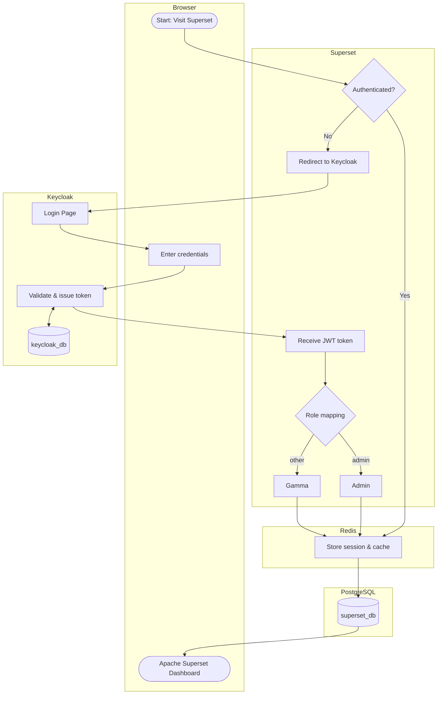

[](https://doi.org/10.5281/zenodo.19567030)

# Data and Knowledge Administration Console

The SoilWise-he project aims to develop an open access knowledge and data metadata catalogue to safeguard soils. This repository contains the configuration of the **Data and Knowledge Administration Console**, which integrates [Apache Superset](https://superset.apache.org/) with [Keycloak](https://www.keycloak.org/) to provide a secure, role-based dashboard environment for authorised users of the SoilWise Repository (SWR).

## Features

- **Keycloak authentication** — Users log into Superset via Keycloak; account creation and management are handled exclusively by a Keycloak administrator
- **Role-based access control** — Keycloak roles are mapped to Superset roles (Admin, Gamma) at login via JWT token claims
- **Rich visualisation** — Interactive charts, tables, and dashboard pages built on Apache Superset 
- **Redis session and cache** — Superset sessions and query results are cached in Redis for faster performance
- **Realm configuration** — A pre-configured Keycloak realm export enables reproducible setup of the Keycloak–Superset integration

## Installation

### Using Docker (recommended)

1. Clone this repository:
   ```bash
   git clone https://github.com/soilwise-he/summary-dashboard.git
   cd summary-dashboard
   ```
2. Build and start all services:
   ```bash
   docker-compose up --build
   ```

### Local setup

```bash
pip install -r requirements.txt
```

Ensure PostgreSQL, Redis, and a running Keycloak instance are accessible, then configure your `.env` file accordingly.

## Usage

Once running, the console is accessible via the Superset web interface. Users are **not** self-registered — a Keycloak administrator must create accounts and assign roles before a user can log in.

### Authentication flow

1. A user visits the Superset URL.
2. If not authenticated, Superset redirects to the Keycloak login page.
3. The user enters their Keycloak credentials.
4. Keycloak validates the credentials and issues a JWT token.
5. Superset receives the token, maps the role (`admin` → Admin, other → Gamma), and opens the dashboard.

### Available endpoints

**Superset UI:**

```
http://<host>:<port>
```

**Keycloak admin console:**

```
http://<host>:<keycloak-port>/admin
```

### API fields

| Field                      | Description                                        |
| -------------------------- | -------------------------------------------------- |
| `KEYCLOAK_REALM`         | Name of the Keycloak realm used for authentication |
| `KEYCLOAK_CLIENT_ID`     | Client ID registered in Keycloak for Superset      |
| `KEYCLOAK_CLIENT_SECRET` | Client secret for the Superset Keycloak client     |
| `SUPERSET_SECRET_KEY`    | Secret key for Superset session encryption         |
| `REDIS_URL`              | Connection URL for Redis session and cache store   |

### Main Components Diagram



## Additional Information

### Architecture

| Technology      | Role                                                                                   |
| --------------- | -------------------------------------------------------------------------------------- |
| Apache Superset | Dashboard configuration, visualisation, and SQL editor                                 |
| Keycloak        | User management, authentication, and role assignment                                   |
| PostgreSQL      | Stores Superset metadata, catalogue contents, and validation results                   |
| Redis           | Session storage and query result caching                                               |
| Docker          | Containerised deployment of all services                                               |
| Kubernetes      | Production orchestration of all services                                               |
| Terraform       | Infrastructure provisioning and configuration management for the Kubernetes deployment |

### Database Design

**superset_db** — PostgreSQL database storing Superset internal metadata: dashboards, charts, data source configurations, and user–role mappings received from Keycloak.

**keycloak_db** — PostgreSQL database used by Keycloak to persist realm configuration, users, roles, and client credentials.

### Key Design Decisions

- Authentication is delegated entirely to Keycloak; Superset does not manage user accounts or passwords directly.
- Role mapping is performed at login time using JWT token claims, keeping access control centralised in Keycloak.
- A Keycloak realm configuration file is provided in the repository to enable reproducible and consistent setup of the integration across environments.
- Redis is used for both session persistence and data caching, reducing repeated queries to the underlying PostgreSQL database.
- The console is restricted to authorised users only; no public or anonymous access is permitted.

---

## SoilWise-he Project

This work has been initiated as part of the [SoilWise-he](https://soilwise-he.eu) project. The project receives funding from the European Union's HORIZON Innovation Actions 2022 under grant agreement No. 101112838. Views and opinions expressed are however those of the author(s) only and do not necessarily reflect those of the European Union or Research Executive Agency. Neither the European Union nor the granting authority can be held responsible for them.
